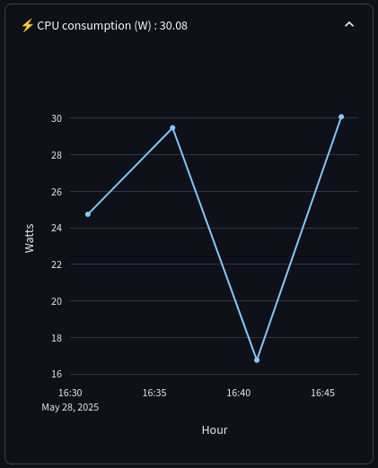

# supervision
Monitoring for linux system

## View with streamlit & plotly



## install

git clone \<me\>

```bash
python<version> -m venv supervision
source supervision/bin/activate

python -m pip install --upgrade pip
python -m pip install -r requirements.txt

cd supervision
# allow power read
sudo chmod +x read_power.sh
ABS_PATH=$(realpath read_power.sh)
grep -qF "$USER ALL=(ALL) NOPASSWD: $ABS_PATH" /etc/sudoers.d/read_power || \
echo "$USER ALL=(ALL) NOPASSWD: $ABS_PATH" | sudo tee /etc/sudoers.d/read_power
sudo visudo -cf /etc/sudoers.d/read_power
# > etc/sudoers.d/read_power: parsed OK

streamlit run app.py
```

### TODO
- **done** delete warning message about graph for missing label  
2025.05.28 - this was not in graphes but in radio button  
I let you find the way to detect it ^^  